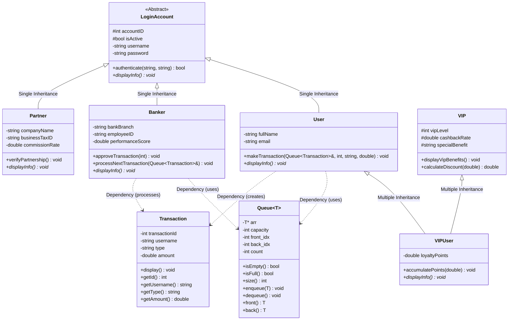
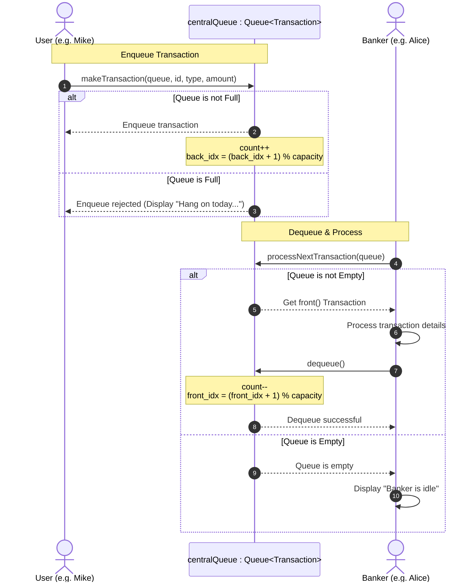

# Banking System OOP Project Workflow

This document details the development, compilation, and system-level execution workflows for the **Banking System** project. 

---

## 1. System Architecture & Class Hierarchy

The system is designed around standard Object-Oriented Programming (OOP) paradigms using C++. Below is the structural hierarchy of the accounts and services.



### Key Relationships
* **[LoginAccount](LoginAccount.h)** acts as the polymorphic base class for **[User](User.h)**, **[Banker](Banker.h)**, and **[Partner](Partner.h)**.
* **[VIPUser](VIPUser.h)** uses multiple inheritance to combine **[User](User.h)** behavior and **[VIP](VIP.h)** benefits.
* **[Queue](Queue.h)** is a generic circular buffer template. It operates as the transaction pipeline where **[User](User.h)** is the producer and **[Banker](Banker.h)** is the consumer of **[Transaction](Transaction.h)** objects.

---

## 2. Core Execution Workflow (Transaction Pipeline)

The central simulation runs in **[main3.cpp](main3.cpp)**. Here is the operational sequence for creating and processing banking transactions:



### Detailed Execution Steps:
1. **Initialization:** A `Queue<Transaction>` central queue is initialized. `User` objects and a `Banker` object are instantiated.
2. **Generation:** Users call `makeTransaction()`, which wraps the details into a `Transaction` class and enqueues it.
3. **Queue Mechanism:** The queue tracks elements using a circular buffer array using `front_idx`, `back_idx`, and `count`.
4. **Consumption:** The Banker calls `processNextTransaction()`, dequeuing one transaction at a time and executing business logic (printing status updates).

---

## 3. Compilation & Build Workflow

The project contains three separate entry points (Demos). Make sure your current working directory is the project folder before running these commands.

> [!NOTE]
> Because `Queue.cpp` is a template implementation, it is included directly via `#include "Queue.cpp"` at the bottom of `Queue.h`. Consequently, `Queue.cpp` **should not** be compiled as a standalone unit in the `g++` command list, as it will be transitively compiled with headers that include `Queue.h`.

### Demo 1: Polymorphism & Multiple Inheritance
Test the class hierarchy and the virtual method bindings.
* **Target File:** [main.cpp](main.cpp)
* **Compile and Run:**
  ```bash
  g++ main.cpp LoginAccount.cpp User.cpp Banker.cpp Partner.cpp VIPUser.cpp VIP.cpp Transaction.cpp -o main
  ./main
  ```

### Demo 2: Generic Queue Test
Verify boundary limits (overflow, underflow) of the circular buffer with simple integer types.
* **Target File:** [main2.cpp](main2.cpp)
* **Compile and Run:**
  ```bash
  g++ main2.cpp -o main2
  ./main2
  ```

### Demo 3: End-to-End Banking Simulation
Run the full producer-consumer queue simulation featuring Users, Bankers, and Transactions.
* **Target File:** [main3.cpp](main3.cpp)
* **Compile and Run:**
  ```bash
  g++ main3.cpp LoginAccount.cpp User.cpp Banker.cpp Partner.cpp VIPUser.cpp VIP.cpp Transaction.cpp -o main3
  ./main3
  ```

---

## 4. Development Guidelines

When modifying or expanding the banking system, follow these standards:

### 1. Separation of Concerns
* Define classes in separate header files (`.h`) and implement them in corresponding `.cpp` source files.
* Preserve the template layout used in [Queue.h](Queue.h) and [Queue.cpp](Queue.cpp) (using `#ifdef QUEUE_H` inside the `.cpp` file and `#include "Queue.cpp"` in the `.h` file).

### 2. Polymorphism Best Practices
* Always declare the virtual destructor in base classes to prevent memory leaks during cleanups:
  ```cpp
  // Inside LoginAccount.h
  virtual ~LoginAccount();
  ```
* Mark overridden methods in derived classes with the `override` keyword to leverage compiler verification.

### 3. Avoiding Circular Dependencies
* Use forward declarations for templates inside non-templated headers.
* For example, in [User.h](User.h):
  ```cpp
  template <typename T> class Queue;
  ```
  This prevents circular include references when defining `makeTransaction(Queue<Transaction>& bankQueue, ...)`.
